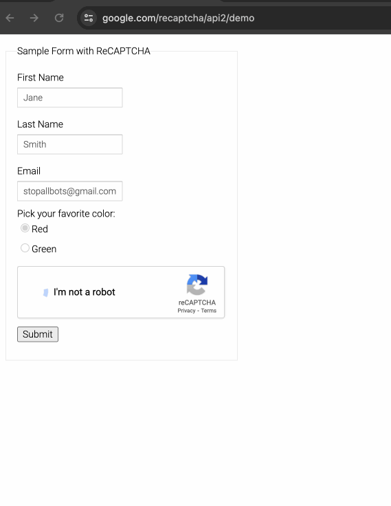

<h1 align="center">Auto Captcha Pass </h1>

When researching web crawling, we often encounter anti-scraping measures, with one common approach being the use of CAPTCHA. When a user accesses a website too frequently, the site may redirect the request to a CAPTCHA page. Only after successfully entering the CAPTCHA can the user continue accessing the site.

Here are solutions to various types of CAPTCHAs.

### reCAPTCHA 

<p align="center"> </p>

The overall approach is to recognize all captcha images and simulate clicks based on the recognition results to solve the reCAPTCHA, ultimately passing the captcha.  

Recognizing captcha images through deep learning is feasible, but building such a model is no easy feat. It requires a vast amount of data for training, involving the collection of numerous captcha images along with their annotated results. This process demands significant effort.

Here, I recommend a captcha recognition service called [Capsolver](https://www.capsolver.com/). With Capsolver, all we need to do is provide the content to be recognized and the captcha image, and the service will return the corresponding recognition result. 

For simulating operations, I recommend using [DrissionPage](https://github.com/g1879/DrissionPage), a Python-based web automation tool. It combines the convenience of web browser automation with the efficiency of the requests library.  Compared to Selenium, DrissionPage doesn't require a WebDriver, enabling it to traverse iframes, handle multiple browser tabs, and feature straightforward syntax rules.  Another surprising aspect is its seamless integration with [Scrapy](https://scrapy.org/).

<table>
  <tr>
    <td> <a href="https://www.google.com/recaptcha/api2/demo">reCAPTCHA demo</a> </td>
    <td> <a href="https://github.com/ChengGuang-Li/Auto-Captcha-Pass/tree/main/reCaptcha"> Code </a> </td>
  </tr>
</table>

#### How to run 

Configure your Capsolver API key in the  /reCaptcha/**.env**  file.     

```bash
#install DrissionPage 
pip install DrissionPage

#enter reCaptcha folder
cd reCaptcha
#run
python3 main.py 
```


### letter Captcha

<p align="center"> </p>

On some websites like Examtopics, we encounter alphanumeric captchas. These are much simpler compared to reCAPTCHA. The core approach involves fetching the captcha image, performing OCR recognition on it, then filling the recognized result into the input field and clicking submit.  Here, I recommend the captcha OCR recognition library [ddddocr](https://github.com/sml2h3/ddddocr).

```bash
#install DrissionPage 
pip install DrissionPage

#install ddddocr
pip install ddddocr

#enter letterCaptcha folder
cd letterCaptcha 
#run
python3 main.py 
```

